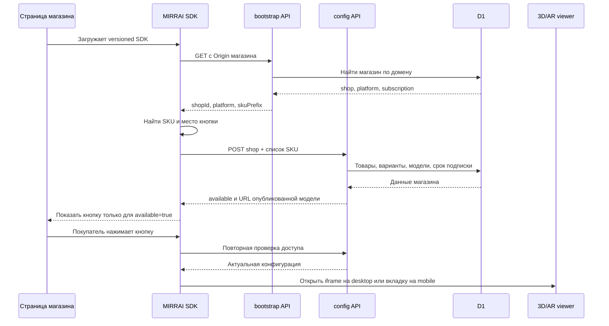
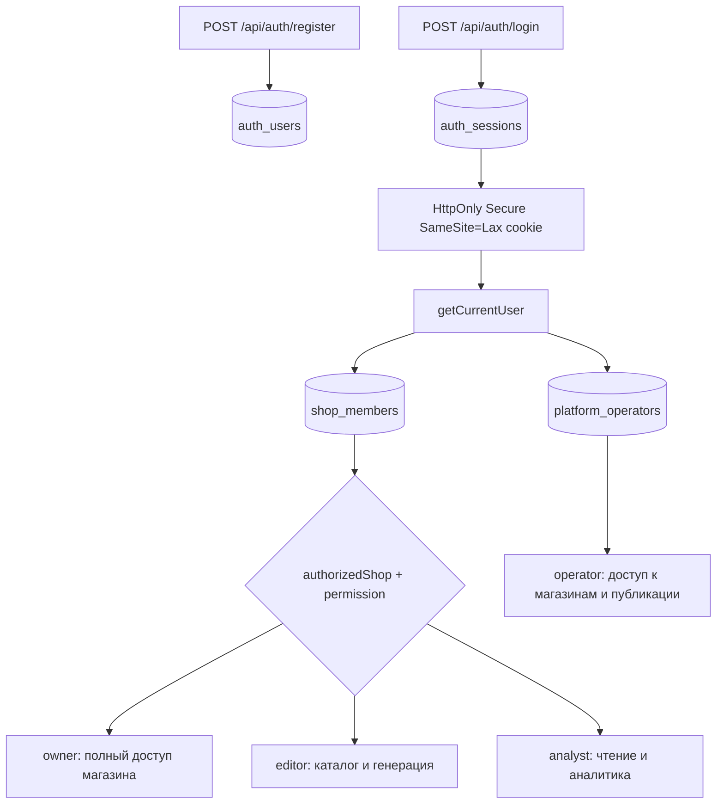
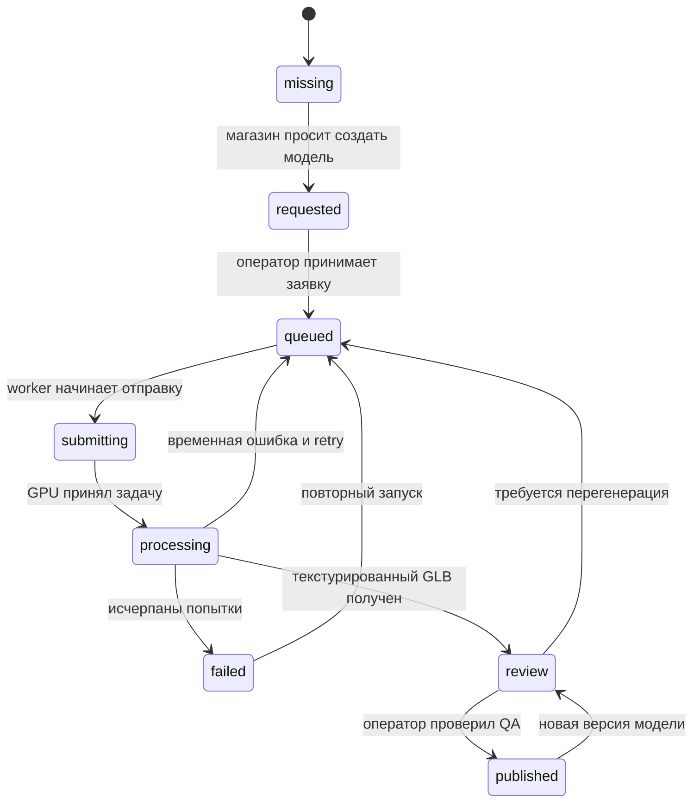
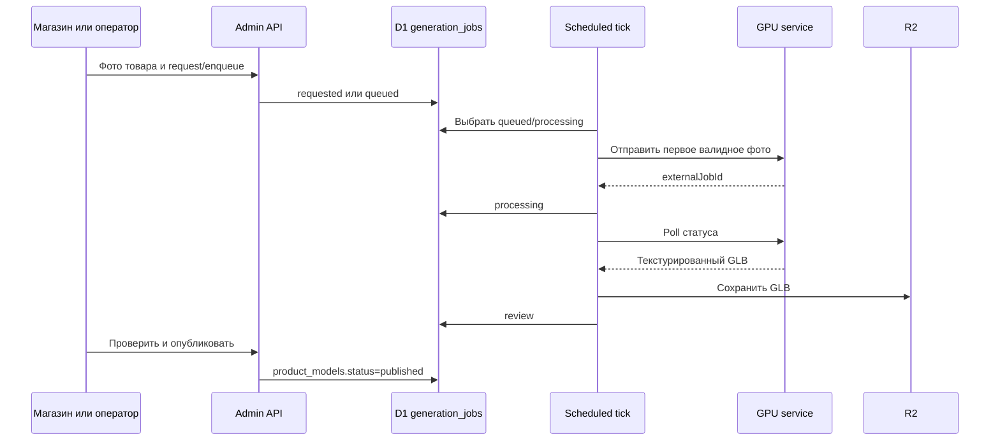
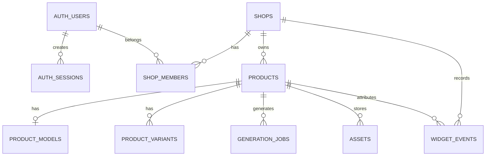

# MIRRAI: техническая архитектура и рабочие потоки

Документ описывает фактическую реализацию MIRRAI на текущем `main`, а не желаемую будущую систему. Он нужен для подключения магазина, сопровождения пилота и поиска неисправностей.

## Честный статус продукта

MIRRAI сейчас является рабочим пилотным SaaS: регистрация, изоляция магазинов, каталог, загрузка файлов, очередь генерации, ручная публикация, виджет, 3D/AR и аналитика реализованы. Виджет можно установить одной вставкой и безопасно использовать без секретного ключа в браузере.

До полностью автономного массового SaaS не хватает:

1. платёжного провайдера, checkout и webhook-событий продления/отмены;
2. постоянного GPU-провайдера с договорным SLA;
3. мониторинга ошибок, uptime-проверок и оповещений;
4. восстановления пароля и подтверждения email;
5. подписанных viewer-сессий, если потребуется мгновенно отзывать уже известные URL моделей;
6. реальных E2E-проверок на Shopify, WooCommerce, OpenCart и Tilda с несколькими темами;
7. автоматических тестов на физических iPhone/Android — браузерные тесты не доказывают качество нативного AR.

Поэтому текущая правильная коммерческая модель — управляемый пилот: MIRRAI подключает первый магазин, проверяет его тему, модели и AR, а не обещает полностью самостоятельную установку для любого сайта.

## Общая схема

```mermaid
flowchart LR
    owner[Владелец магазина] --> auth[Регистрация и сессия]
    auth --> cabinet[Кабинет магазина]
    cabinet --> setup[Настройка домена и платформы]
    cabinet --> catalog[Каталог товаров и вариантов]
    cabinet --> analytics[Аналитика]
    cabinet --> subscription[Статус подписки]

    setup --> db[(D1 / SQLite)]
    catalog --> db
    analytics --> db
    subscription --> db

    catalog --> upload[Загрузка фото, GLB или USDZ]
    upload --> r2[(R2: файлы магазина)]
    upload --> queue[Очередь generation_jobs]
    queue --> gpu[Hunyuan3D / собственный gateway]
    gpu --> review[Ручная QA: геометрия, текстуры, масштаб]
    review --> publish[Статус published]
    publish --> db
    publish --> r2

    store[Сайт магазина] --> sdk[mirrai-widget-2.2.0.js]
    sdk --> bootstrap[/api/widget/bootstrap]
    bootstrap --> db
    sdk --> detect[Определение платформы и SKU]
    detect --> config[/api/widget/config]
    config --> guard{Домен + подписка + товар + published}
    db --> guard
    guard -->|разрешено| button[Кнопка Посмотреть у себя]
    guard -->|нет модели| hidden[Кнопка скрыта]
    guard -->|подписка неактивна| disabled[Нейтрально недоступно]

    buyer[Покупатель] --> button
    button --> viewer[3D viewer]
    viewer --> ar[iOS Quick Look / Android Scene Viewer / WebXR]
    viewer --> events[/api/widget/events]
    events --> db
```

## Как магазин устанавливает виджет сейчас

### Основной вариант: одна вставка

Владелец открывает `/admin/setup`, указывает домен и платформу и получает:

```html
<script src="https://mirrai-try-on.moonlight-5782.chatgpt.site/mirrai-widget-2.2.0.js"
        data-auto="universal"
        defer></script>
```

Скрипт добавляется один раз в общий шаблон сайта перед закрывающим `</body>`.

Секретный API-ключ в HTML не нужен и не должен там находиться. Браузерный доступ подтверждается связкой:

- домен из `Origin` или `Referer`;
- магазин, найденный по разрешённому домену;
- SKU товара;
- активный период подписки;
- опубликованная модель этого товара или варианта.

### Как определяется товар

Коннектор действует в следующем порядке:

1. определяет Shopify, WooCommerce, OpenCart, Tilda или custom по DOM-признакам;
2. читает SKU из Product JSON-LD;
3. пробует селекторы конкретной платформы;
4. если на странице есть `data-mirrai-sku`, использует его как точное значение;
5. URL анализируется только при явном `data-allow-url-sku="true"`.

Для нестандартной темы надёжный резервный вариант:

```html
<div data-mirrai-sku="SKU-ТОВАРА"></div>
```

Кнопка будет создана рядом с этим контейнером. Это предпочтительнее угадывания артикула по URL.

### Платформенные варианты

- Shopify: блок `integrations/shopify/blocks/mirrai-ar.liquid` или общий script-tag.
- WooCommerce: плагин `integrations/woocommerce/mirrai-ar`.
- OpenCart и Tilda: универсальный коннектор; конкретная тема проверяется на пилоте.
- Custom: универсальный скрипт плюс явный `data-mirrai-sku` и, при необходимости, контейнер в нужном месте.

## Последовательность запуска виджета



Повторная проверка при клике важна: истёкшая подписка или снятая с публикации модель не откроется из устаревшего состояния страницы.

## Что происходит после клика

На desktop SDK создаёт modal-overlay с iframe MIRRAI. На мобильном устройство открывает viewer в отдельной вкладке, чтобы браузер не заблокировал переход и нативный AR.

Viewer получает только публичные данные товара:

- название, цену и материал;
- GLB и опциональный USDZ;
- варианты цвета и соответствующие им модели;
- ширину, высоту и глубину в сантиметрах;
- признак действующей подписки.

`<model-viewer>` показывает GLB. Для AR:

- iPhone/iPad использует Quick Look;
- Android использует Scene Viewer или WebXR;
- масштаб в AR фиксирован;
- метрическая геометрия должна быть заранее нормализована: X — ширина, Y — высота, Z — глубина, нижняя точка — `Y=0`.

## Регистрация, роли и разделение магазинов



Пароли хранятся как PBKDF2-SHA256 с индивидуальной солью и 210 000 итераций. В cookie хранится случайный токен, а в D1 — только SHA-256 токена. Сессия действует 30 дней. После пяти неверных попыток вход блокируется на 15 минут.

`authorizedShop()` всегда связывает пользователя с конкретной записью `shop_members` и проверяет разрешение роли. Оператор платформы определяется отдельно через `platform_operators`.

## Каталог и жизненный цикл модели



Генератор никогда не публикует модель автоматически. Готовый GLB получает `review`. Оператор проверяет:

- сходство с фотографией;
- целостность геометрии и ножек;
- текстуры и материалы;
- реальный размер;
- положение на полу;
- загрузку в браузере;
- AR на физическом телефоне.

Только `published` доступен покупателю.

## Поток генерации



Планировщик `.github/workflows/generation-queue.yml` вызывает внутренний endpoint с GitHub OIDC. Прямой URL GPU и его bearer-token существуют только в серверных переменных. Браузер к GPU не обращается.

## Основные данные



- D1: аккаунты, сессии, магазины, роли, товары, варианты, модели, задания и события.
- R2: загруженные фотографии, GLB и USDZ.
- `public/catalog`: проверенные модели рабочего демо HUGGE.
- Sites: production worker, статические файлы, D1/R2 bindings.

## Ответственность компонентов

| Компонент | Отвечает за | Не отвечает за |
|---|---|---|
| `public/mirrai-widget-2.2.0.js` | поиск SKU, вставку кнопки, открытие viewer, отправку событий | право доступа и решение о публикации |
| `/api/widget/bootstrap` | поиск магазина по домену | поиск товара |
| `/api/widget/config` | домен, подписка, SKU, вариант и published-модель | генерацию модели |
| `/api/widget/events` | проверенную запись событий | биллинг |
| `app/auth.ts` | пароль, cookie-сессия, текущий пользователь | OAuth Google и password reset |
| `db/authorization.ts` | tenant isolation и роли | оплату |
| `db/subscription.mjs` | fail-closed проверку срока | списание денег |
| `/api/admin/catalog*` | товары, варианты и импорт | качество 3D |
| `/api/admin/generation` | очередь и связь с GPU | автоматическую публикацию |
| `/api/admin/assets` и R2 | приём и хранение файлов | проверку визуального сходства |
| `<model-viewer>` | 3D-preview и переход в нативный AR | создание геометрии |

## Аналитика

SDK отправляет `widget_open`, `model_ready`, `ar_open`, `object_placed`. Endpoint повторно проверяет магазин, домен, товар и подписку, затем пишет событие в `widget_events`. Кабинет агрегирует последние 30 дней по магазину и товару.

Ограничение: мобильный viewer, открытый в отдельной вкладке, не всегда может вернуть все события через `postMessage` родительской странице. Для полной мобильной атрибуции нужен подписанный viewer-session ID.

## Поведение при ошибках

| Сбой | Что увидит покупатель | Что делать оператору |
|---|---|---|
| SKU не найден | кнопка не создаётся | добавить `data-mirrai-sku` |
| модель отсутствует или не published | кнопка скрыта | загрузить/проверить/опубликовать модель |
| подписка истекла | кнопка отключается нейтрально | продлить период в биллинге/кабинете оператора |
| config API временно недоступен | «Повторить загрузку AR» | проверить Sites и D1 |
| GLB недоступен | viewer не загрузит модель | проверить URL, R2 и content type |
| GPU недоступен | задача остаётся/возвращается в очередь, затем failed | проверить gateway и retry |
| неверный домен | API отвечает 403 | исправить `allowed_domains` |
| дефектная генерация | покупатель её не видит, пока статус review | отклонить и перегенерировать |

## Что защищает от поломок сейчас

- versioned SDK `2.2.0`; совместимый URL сохранён отдельно;
- fail-closed доступ: сеть, подписка и домен не дают открыть старую модель;
- IP-wide и per-shop rate limits;
- проверка сигнатуры GLB, USDZ и изображений;
- лимиты размера загружаемых файлов;
- tenant isolation по `shop_members`;
- три попытки генерации и ручная QA;
- CI на Ubuntu: `npm ci`, lint, typecheck, Python auth tests, build и Node tests;
- аудит масштаба всех демо-моделей перед каждой полной тестовой сборкой;
- GitHub OIDC для внутреннего generation tick вместо постоянного cron-секрета.

## Что необходимо для production SLA

Приоритет P0 до самостоятельных платных регистраций:

1. Stripe/Paddle checkout, webhooks и идемпотентная таблица платежных событий.
2. Подключить отправителя почты и проверить реальную доставку: email verification и password reset реализованы, но требуют `APP_ORIGIN`, `RESEND_API_KEY`, `MAIL_FROM`. Уведомления о входе/окончании подписки ещё не реализованы.
3. Sentry или аналог для frontend/worker, uptime monitor и alert на очередь `failed`.
4. Синтетический тест: bootstrap → config → GLB HEAD → viewer.
5. E2E-матрица реальных тестовых магазинов по каждой поддерживаемой CMS.
6. Версионирование и rollback моделей отдельно от релиза приложения.
7. Индексированная таблица доменов магазина вместо полного сканирования `shops` в bootstrap.
8. Signed viewer session для полной аналитики мобильной вкладки и контролируемой выдачи моделей.
9. Политика резервного копирования D1/R2 и проверенный restore drill.

Приоритет P1 после первых пилотов:

1. Google OAuth как дополнительный вход.
2. API-ключи только для серверных интеграций магазинов, с scopes, expiry и revoke.
3. Webhook/API каталога для крупных клиентов.
4. Автоматический canary и staged rollout SDK.
5. Отчёт по Core Web Vitals и влиянию SDK на страницу магазина.

## Где искать неисправность

- Кнопка и распознавание страницы: `public/mirrai-widget-2.2.0.js`.
- Домен/CORS: `app/api/widget/cors.ts`, `bootstrap/route.ts`.
- Товар/вариант/подписка: `app/api/widget/config/route.ts`.
- Viewer и AR: `app/page.tsx`.
- События: `app/api/widget/events/route.ts`.
- Пользователь и cookie: `app/auth.ts`.
- Права магазина: `db/authorization.ts`.
- Подписка: `db/subscription.mjs`.
- Файлы: `app/api/admin/assets/route.ts`, `app/api/assets/[id]/route.ts`, `db/storage.ts`.
- Генерация: `app/api/admin/generation/route.ts`, `app/api/internal/generation/tick/route.ts`.
- Схема данных: `db/schema.ts`, `drizzle/`.
- Развёртывание: `.openai/hosting.json`, `.github/workflows/ci.yml`.

## Минимальный приёмочный сценарий магазина

1. Зарегистрировать владельца и создать магазин.
2. Указать production-домен и платформу.
3. Импортировать один реальный товар с размерами.
4. Загрузить и опубликовать проверенный GLB.
5. Вставить versioned SDK в staging-тему магазина.
6. Убедиться, что bootstrap определяет магазин.
7. Убедиться, что SKU определяется автоматически; иначе добавить `data-mirrai-sku`.
8. Проверить desktop viewer.
9. Проверить iPhone Quick Look и Android Scene Viewer.
10. Проверить масштаб физической рулеткой.
11. Убедиться, что события появились в аналитике.
12. Отключить подписку и проверить fail-closed поведение.
13. Вернуть подписку и проверить восстановление без переустановки SDK.
